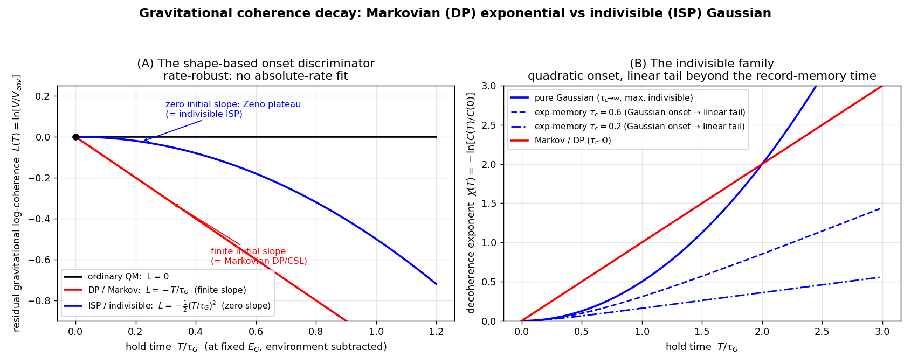

# Non-Markovian Gravitational Decoherence: A Gaussian-Onset Alternative to the Diósi–Penrose Exponential

*An indivisible-stochastic-process motivation and a shape-based interferometric test*

**Felix Robles Elvira**

*Manuscript — foundations of quantum mechanics / gravitational decoherence.*

---

## Abstract

Gravitationally induced decoherence, in the Diósi–Penrose (DP) form, predicts that a
spatial superposition of a massive body loses coherence at a rate set by the
gravitational self-energy `E_G` of the mass-density difference between the branches,
with characteristic time `τ_G = ℏ/E_G`. The DP law is exponential in time, a form that
follows from an implicit Markov (memoryless, divisible) assumption about the underlying
stochastic dynamics. We examine gravitational decoherence within the framework of
*indivisible stochastic processes* (ISP) of Barandes, whose defining feature is the
failure of the divisibility (Chapman–Kolmogorov) property. Indivisibility motivates
treating the gravitational record-mismatch noise as non-Markovian (finite memory time
`τ_c`) rather than white. ISP motivates this finite-memory replacement, and an explicit
division-event model (§4.3) grounds the resulting exponential kernel and pins `τ_c` — modulo one
stated ansatz, with the energy scale inherited from DP. We show that any such finite-memory
noise — a finite, regular covariance with no white component — generically replaces
the DP exponential with a **non-exponential coherence decay whose short-time exponent is
quadratic** — Gaussian, `C(T) = C(0)·exp[−½(T/τ_G)²]`, when the mismatch-energy
fluctuation scale is of order `E_G` and `τ_c` is at least of order `τ_G` — crossing over
to a DP-slope exponential tail at later times. The strict DP exponential is recovered in
the white-noise limit (`τ_c → 0` at fixed noise power), where the Gaussian onset window
closes. The
distinction is experimentally sharp and *rate-robust* (it does not rely on fitting a single
exponential rate): the *onset shape* of
the residual gravitational log-coherence is linear in `T` for Markovian collapse (finite
initial slope) and quadratic (zero initial slope, a Zeno-like plateau) for the indivisible
case. We give threshold masses and separations for levitated-nanosphere, matter-wave, and
mechanical-cat-state platforms, set out differential strategies (notably a density lever and
common-mode subtraction) to separate the gravitational onset from environmental backgrounds, and
confront the radiation and heating bounds, which constrain only the model's regularization length —
the per-nucleon emission (`∝1/R_0³`), decoupled from the (`R_0`-independent) collective decoherence
the interferometer measures (`∝GM²/R`) — so the finite-memory modification changes the *onset shape*,
not the radiation phenomenology. We are explicit about scope: the
quadratic onset is the generic signature of non-Markovian decoherence and is shared with
other coloured-noise collapse models, so the test falsifies *strict* Markovian
DP/CSL and would be *evidence for* a non-Markovian fundamental channel consistent with ISP,
but does not by itself single out ISP.

---

## 1. Introduction

The persistence of quantum coherence for increasingly massive systems is one of the
sharpest open questions at the quantum–classical and quantum–gravity interfaces.
Objective-collapse models posit a fundamental, observer-independent mechanism that
suppresses macroscopic superpositions [4–7]. Among them, the proposals of Diósi [2,3]
and Penrose [1] tie this suppression specifically to gravity: a superposition of two
distinct mass distributions is a superposition of two distinct spacetime geometries, and
the gravitational self-energy of their difference sets a decoherence time
`τ_G = ℏ/E_G`. This "Diósi–Penrose" (DP) decoherence is now an active experimental
target, both directly through matter-wave and optomechanical interferometry [16,19,23,26,27]
and indirectly through spontaneous-radiation searches [8,9], the latter having already
excluded the simplest, parameter-free DP model [8].

The DP coherence law is exponential, `C(T) = C(0)·exp(−T/τ_G)`. This functional form is
not an independent prediction of gravity; it is a consequence of treating the underlying
collapse noise as *white* (delta-correlated in time), equivalently of assuming the
reduced dynamics forms a Markovian semigroup. White noise is an idealization [10],
and the open-systems literature shows that non-Markovian (coloured) environments
generically produce non-exponential coherence decay, with a universal quadratic
(Zeno-like) onset at short times [15,21,22].

In this paper we ask what gravitational decoherence looks like when the underlying
dynamics is taken to be *indivisible* in the sense of Barandes' stochastic-quantum
correspondence [11,12]. An indivisible stochastic process is one whose transition law
does **not** factorize through intermediate times,

$$
\Gamma(t_2,t_0) \neq \Gamma(t_2,t_1)\,\Gamma(t_1,t_0),
$$

i.e. it violates exactly the divisibility property that underlies the Markovian
semigroup. Our central result is that this feature — finite memory in the gravitational
channel — replaces the DP exponential with a non-exponential law whose short-time exponent
is quadratic (Gaussian when the fluctuation scale is of order `E_G`), and that the
difference is experimentally accessible through a *shape-based* onset measurement that
needs no fitted rate. We recover the DP exponential in the white-noise (Markovian) limit,
identify the new time scale `τ_c` that controls the crossover, and confront the existing
spontaneous-radiation bound.

Our claims are deliberately bounded. Indivisibility *motivates* a finite-memory
gravitational channel; an explicit division-event model (§4.3) then grounds the exponential kernel
and pins `τ_c`, at the cost of one stated ansatz, while the amplitude (energy scale) is inherited
from DP. The mechanism is a *reconstruction* of gravitational decoherence within a particular
stochastic ontology, and the new, falsifiable content is the non-exponential onset, not the
energy scale. The quadratic onset is the generic signature of
non-Markovianity and is not unique to ISP. The robust, central claim is that the DP exponential is a
Markovian idealization and that finite memory yields a falsifiable onset-shape discriminator; the
radiation and heating bounds (Section 8) constrain only the model's regularization length and decouple
from the (`R_0`-independent) decoherence, so they do not threaten the prediction. We make these
limitations explicit in Section 9.

## 2. Indivisible stochastic dynamics and the record-stabilization hypothesis

Barandes' stochastic-quantum correspondence [11,12] establishes that a broad class of
quantum systems can be represented as stochastic processes over a configuration space
in which the configuration is a definite quantity ("beable") at all times, with the
unitary, Hilbert-space description emerging as an exact reformulation. The processes that
correspond to generic quantum evolution are *indivisible*: their transition matrices do
not satisfy the Chapman–Kolmogorov composition law except at isolated *division events*,
times at which the process momentarily factorizes and behaves Markovianly. Division
events are, in this picture, the natural locus of effective measurement and record
formation [11,12].

We adopt the following hypothesis, consistent with this picture and with the
gravitational-decoherence proposals [1–3,20]: when two coherent branches carry distinct
effective mass-density records, the gravitational distinguishability of the corresponding
geometries acts as a channel that *stabilizes* the branches into distinct records. The
stabilization is not a primitive collapse postulate; it is the statement that the
gravitational mismatch supplies a positive, accumulating "cost" that suppresses the
survival of the unstabilized (coherent) alternative. We make this quantitative in the
next two sections and emphasise where the indivisible structure changes the result.

We distinguish three physically separate effects, only the third of which is the subject
of this paper:

1. **Environmental decoherence** — ordinary scattering, gas collisions, thermal emission;
   reducible in principle by better isolation [14,16].
2. **Unitary gravitational phase** — gravity shifts the relative phase of the branches
   without destroying coherence.
3. **Gravitational record stabilization** — the geometric mismatch itself acts as a
   branch-stabilizing (decohering) channel. This is the putative new physics.

## 3. Gravitational mismatch energy and the Markovian (Diósi–Penrose) limit

Let the two branches carry mass densities `ρ_r(x)` and `ρ_r′(x)`, with difference
`δρ(x) = ρ_r(x) − ρ_r′(x)`. Following Diósi and Penrose [1–3], the gravitational
mismatch energy is the Newtonian self-energy of the difference,

$$
E_G = \frac{G}{2}\int d^3x\,d^3y\;\frac{\delta\rho(x)\,\delta\rho(y)}{|x-y|}.
$$

`E_G` is non-negative once a finite object size is retained; the point-mass limit is not
admissible because it diverges, exactly the regularization issue that the experimental
bounds constrain [8]. Define the dimensionless gravitational action accumulated over a
hold time `T`,

$$
a(T) = \frac{E_G\,T}{\hbar}, \qquad \tau_G = \frac{\hbar}{E_G}.
$$

The standard DP result is the exponential coherence law

$$
C(T) = C(0)\,\exp(-T/\tau_G).
$$

It is instructive to see precisely which assumption produces the exponential. Write the
survival factor `S(E_G,T) = |C(T)|/|C(0)|`. If one assumes (i) time multiplicativity
`S(E_G, T+U) = S(E_G,T)·S(E_G,U)`, (ii) additivity of independent cost channels
`S(E₁+E₂, T) = S(E₁,T)·S(E₂,T)`, and (iii) dependence only on the dimensionless
action `a`, then the Cauchy functional equation forces

$$
S = \exp(-\kappa\,a) = \exp(-\kappa\,E_G T/\hbar),
$$

with the coefficient `κ` fixed by normalization. Assumption (i) is the semigroup
(Chapman–Kolmogorov) property: it states that processing over the whole interval
factorizes into independent processing over its parts. **This is the divisibility /
Markov assumption.** (This functional argument is not the historical derivation of DP, which
follows from a Markovian master equation [2,20]; it serves only to isolate the semigroup
assumption behind *any* exponential survival law.) The DP exponential is therefore the
Markovian special case of a more general survival functional. We now drop assumption (i), as
the indivisible structure requires.

## 4. Indivisible dynamics and non-exponential decoherence

### 4.1 A minimal finite-memory model

Indivisibility motivates *finite memory*, but a specific coherence law needs an explicit
model. We state one as a benchmark and label every assumption, since not all of them come
from ISP. Let the relative phase between the branches accumulate from a real gravitational
record-mismatch energy `δE(t)`,

$$
\varphi(T) = \frac{1}{\hbar}\int_0^T \delta E(t)\,dt, \qquad
\frac{C(T)}{C(0)} = \big\langle e^{i\varphi(T)}\big\rangle,
$$

and posit:

- **(M1) Gaussian, stationary noise — standard.** `δE(t)` is a stationary Gaussian process with
  covariance `K(s) = Cov[δE(t), δE(t+s)]`; then the cumulant expansion truncates at second order
  and the coherence modulus is `|⟨e^(iφ)⟩| = exp(−½ Var φ)` exactly (any nonzero mean of `δE`
  contributes only the unitary phase of §2). This is the ordinary Gaussian-dephasing model, not
  specific to ISP.
- **(M2) Amplitude set by `E_G` — the DP ansatz.** The fluctuation scale is the gravitational
  self-energy of the mass-density difference, `σ_E ~ E_G`. Note `δE` is a genuine *fluctuation*,
  not a definite phase rate: a definite `δE` would give only the unitary phase of §2, and it is
  the *randomness* of `δE` that decoheres. That the gravitational self-energy of a superposition
  is *indefinite* — hence a noise of scale `E_G` rather than a phase — is the Diósi–Penrose
  hypothesis, taken over unchanged.
- **(M3) Finite memory — the ISP-motivated part.** `K(s)` has a finite correlation
  (record-memory) time `τ_c` and is *not* white. This is the one ingredient indivisibility
  supplies: a non-divisible process does not decorrelate instantaneously, so the white-noise
  idealization underlying DP is dropped.

Under (M1) the coherence obeys the standard second-cumulant decoherence functional [15,21]
(we write the decoherence exponent `χ(T)`, reserving `Γ` for Barandes' transition matrix)

$$
\ln\frac{|C(T)|}{|C(0)|} = -\,\chi(T), \qquad
\chi(T) = \frac{1}{2\hbar^2}\int_0^T\!\!\int_0^T K(t_1 - t_2)\,dt_1\,dt_2 .
$$

It is convenient to name the *noise power* `D_E ≡ σ_E²·τ_c`, so the zero-frequency weight is
`S(0) = ∫K ds = 2·D_E`. Only (M3) is ISP's; (M1) is standard and (M2) is DP's, and everything
below is the consequence of (M3) — that `K` is not white — for the *shape* of `C(T)`. Two
limits bracket the behaviour.

**Markovian (white-noise) limit** (`τ_c → 0` at fixed noise power `D_E`, so `K → 2·D_E·δ`):
the double integral is linear in `T`, `χ(T) = (D_E/ℏ²)·T`, recovering the DP exponential and
identifying `1/τ_G = E_G/ℏ` when `D_E = E_G·ℏ`. This limit fixes the *power*, not the amplitude:
as `τ_c → 0`, `σ_E → ∞`.

**Fully-correlated limit** (`τ_c → ∞`, an idealized limit in which the hold spans a single
indivisible transition with no internal decorrelation — not the literal content of
indivisibility, which is only the failure of factorization): here it is instead the *amplitude*
`σ_E` that is held fixed, `K ≈ σ_E²` is constant, so

$$
\chi(T) = \tfrac{1}{2}\Big(\frac{\sigma_E T}{\hbar}\Big)^2,
$$

a quadratic exponent and hence a Gaussian coherence decay.

### 4.2 The prediction hierarchy

It helps to separate what finite memory *forces* from what the benchmark closure *adds*.

**Generic finite-memory onset — closure-independent.** Expanding the functional for `T ≪ τ_c`,
where `K(t₁−t₂) ≈ σ_E²`, gives a quadratic exponent

$$
\boxed{\,\chi(T) = \frac{\sigma_E^2}{2\hbar^2}\,T^2 + \text{higher order},\,}
$$

a *zero-initial-slope* decay whatever the kernel's detailed shape. This is the robust,
falsifiable content; it does not depend on identifying `σ_E` with `E_G`.

**Benchmark closure.** The two scales are fixed by the self-consistent closure (derived in §4.3 from
the division-event model), `σ_E ~ E_G` and `τ_c ~ τ_G` — the unique closure built from the single
available scale `E_G` (its only time is `ℏ/E_G`, its only energy `E_G`), reinforced by the
argument that the record-memory time equals the stabilization time.

**Benchmark prediction.** In the onset region `T ≲ τ_c` the closure gives a Gaussian at DP's
scale,

$$
\boxed{\,C(T) = C(0)\,\exp\!\Big[-\tfrac{1}{2}\,(T/\tau_G)^2\Big], \qquad \tau_G = \hbar/E_G,\,}
$$

crossing over to a DP-slope exponential tail at later times.

For a generic finite `τ_c` with the exponential memory kernel `K(s) = σ_E² e^(−|s|/τ_c)` the
full closed form is

$$
\chi(T) = \frac{\sigma_E^2\,\tau_c^2}{\hbar^2}\Big(\frac{T}{\tau_c} - 1 + e^{-T/\tau_c}\Big),
$$

Gaussian for `T ≪ τ_c` and linear (DP-slope) for `T ≫ τ_c`. The long-time slope is set by the
noise power `D_E = σ_E²·τ_c`, the onset curvature by the amplitude `σ_E²`, so the Gaussian onset
time is `τ_Gauss = √(τ_c·τ_G)`, equal to `τ_G` only at the closure `τ_c ~ τ_G`. One must
therefore *not* recover DP by taking `τ_c → 0` at fixed `σ_E`, where the slope vanishes; the
strict DP exponential is the white-noise limit (`D_E` held at `E_G·ℏ`, `τ_c → 0`, `σ_E → ∞`), in
which the Gaussian onset window closes. (The divergent amplitude `σ_E → ∞` of that limit is the source
of white-noise DP's ultraviolet radiation problem; a finite `τ_c` band-limits the noise in time — a
*temporal* regulator complementary to DP's *spatial* regularization `R_0`, see Section 8.) At the closure `D_E = E_G·ℏ` automatically, so the
late-time tail carries exactly the DP slope `1/τ_G`: a single self-consistent law (Gaussian
onset, DP-slope tail, crossover at `τ_G`), not a one-parameter interpolation at fixed amplitude.

The short-time quadratic onset is not an artefact of the exponential kernel; it is the universal
consequence of finite-correlation-time (smooth) noise, identical in origin to the quantum-Zeno
short-time behaviour of any open system [22], and is required by `χ'(0)=0` whenever the noise has
no white (delta) component.

**What is forced, inherited, and assumed.** In sum: the *quadratic onset* (zero initial slope) is
forced by finite memory (M3); the *energy scale* `E_G` is inherited from Diósi–Penrose (M2); the
*Gaussian form at* `τ_G` follows only after the benchmark closure. The model is therefore a
finite-memory, DP-family phenomenology *motivated* by ISP — not a first-principles derivation of
the memory kernel from indivisible dynamics.

### 4.3 A microscopic division-event model

The exponential kernel and the scale `τ_c` need not be assumed — both follow from an explicit
indivisible model of the channel. Model the gravitational record channel as a *renewal-reset*
process: `δE(t)` is held constant between Barandes division events and redrawn (the record
stabilizing) at each, with division events forming a renewal process of mean spacing `τ_c`. The
stationary autocovariance is then

$$
K(s) = \sigma_E^2\,P_{\mathrm{same}}(s), \qquad
P_{\mathrm{same}}(s) = \frac{1}{\tau_c}\int_s^{\infty} (\tau-s)\,\psi(\tau)\,d\tau ,
$$

fixed by the division-waiting-time law `ψ`. **Memoryless (Poisson) division events give exactly the
exponential kernel** `K(s) = σ_E² e^(−|s|/τ_c)` assumed above, with `τ_c` the mean inter-division
time; regular divisions give instead a triangular kernel — so the kernel shape encodes the division
statistics, a microstructure that colored-noise CSL lacks.

The scale `τ_c` is then fixed self-consistently rather than dimensionally: a division event *is* a
record stabilization, which occurs once the channel has accumulated order-unity decoherence,
`χ(τ_c) ≈ 1`. With `σ_E ∼ E_G`,

$$
\chi(\tau_c) = \Big(\frac{\tau_c}{\tau_G}\Big)^2 e^{-1} = 1
\;\Longrightarrow\; \tau_c \approx 1.65\,\tau_G ,
$$

pinning the crossover to `τ_G` (see Section 7 for the alternative candidate scales). This converts the
two inputs of §4.1–§4.2 — the exponential kernel and `τ_c ∼ τ_G` — into consequences of a single
assumption: that the gravitational record channel undergoes memoryless division events.

We are explicit that the renewal-reset dynamics is itself a model. It makes Barandes' division events
concrete and reproduces the kernel, but deriving it from the full configuration-space indivisible
process for a gravitationally-coupled system remains open. So this grounds the kernel one level
deeper — in the division-event structure — without claiming a first-principles derivation.

**On the state-dependence this introduces.** Because `τ_c ≈ 1.65 τ_G ∝ 1/E_G`, the record-memory time
scales with the experimentally-chosen mass configuration. This is *not* a dynamical backreaction or a
Schrödinger–Newton nonlinearity: `χ(τ_c) ≈ 1` is an algebraic self-consistency condition that fixes a
parameter once `E_G` is given, not a self-potential sourced by the wavefunction (the mean-field
Schrödinger–Newton effect is a deterministic phase *shift* with no decay — a separate entry in the
Section 5 classification, already bounded by optomechanics [24]). For a fixed preparation the dynamics
is an ordinary *linear* dephasing channel, and the `E_G`-dependence of `τ_c` is the same kind of
state-dependence as the `E_G`-dependence of the decay *rate* `1/τ_G` in standard DP/CSL. What differs
is the bookkeeping: DP/CSL obtain that dependence as an *emergent* matrix element of a master equation
with state-independent coefficients (`R_0`, `λ`), whereas here `τ_c` is fixed *from* the two-branch
`E_G`. The relation `τ_c ∼ τ_G` is therefore an **effective, two-branch description** — adequate for
the interferometric test, where `E_G` is a fixed number — and not yet a fundamental, state-independent
law for arbitrary (multi-branch, continuous) superpositions; supplying that law is part of the same
open problem as grounding the division dynamics in Barandes' formalism.

## 5. A shape-based interferometric discriminator

The practical signature is the *shape* of the decay near `T = 0`; the discriminating feature
is its leading power in `T`, which is *rate-robust* — it does not rely on an absolute
collapse-rate fit. Prepare a spatial superposition with fixed gravitational mismatch `E_G` and a
fixed environmental budget `Γ_env`, and measure the interferometric visibility `V(T)`.
Define the residual gravitational log-coherence by subtracting the separately measured
environmental contribution (e.g. by repeating at `E_G → 0`, i.e. negligible separation),

$$
L(T) = \ln\frac{V(T)}{V_{\mathrm{env}}(T)}.
$$

The three hypotheses give qualitatively distinct onsets:

$$
L(T) =
\begin{cases}
0, & \text{ordinary quantum mechanics (no fundamental channel),}\\[2pt]
-\,T/\tau_G, & \text{Markovian DP/CSL: finite initial slope (straight line),}\\[2pt]
-\,\tfrac{1}{2}(T/\tau_G)^2, & \text{indivisible ISP: zero initial slope (parabola tangent to the axis).}
\end{cases}
$$

The discriminator is therefore

$$
\boxed{\;\text{straight line through the origin} \Rightarrow \text{Markovian DP/CSL};\qquad
\text{parabola tangent at the origin} \Rightarrow \text{indivisible ISP}.\;}
$$

Because the *shape* (linear vs quadratic onset) is independent of the overall
coefficient, the test does not require knowing `τ_G` in advance, nor the absolute
collapse strength — only the ability to vary `E_G` while holding the environment fixed,
and to resolve the curvature of `L(T)` at small `T` (distinguishing a small linear slope
from a small quadratic curvature is itself a statistical task, but one that needs no
absolute-rate calibration).

*Figure 1. The shape-based discriminator. **(A)** Residual gravitational log-coherence
`L(T) = ln(V/V_env)` at fixed `E_G`: ordinary quantum mechanics gives `L = 0`; Markovian DP/CSL a
straight line through the origin (finite initial slope); the indivisible finite-memory channel a
parabola tangent to the axis (zero initial slope, a Zeno-like plateau). The discriminating feature
is the leading power of `T`, which needs no absolute-rate calibration. **(B)** The decoherence
exponent `χ(T) = −ln[C(T)/C(0)]` for the finite-memory family: a pure Gaussian (`τ_c → ∞`),
exponential-memory kernels with finite `τ_c` (Gaussian onset crossing to a linear, DP-slope tail
beyond the record-memory time `τ_c`), and the Markovian DP limit (`τ_c → 0`). The benchmark closure
sits at `τ_c ~ τ_G`.*

**How large is the effect, and what precision does it need?** At fixed `E_G` the two candidate
visibility curves are `V_exp = e^(−x)` (Markovian DP) and `V_Gauss = e^(−x²/2)` (benchmark ISP),
with `x = T/τ_G`:

| `x = T/τ_G` | `V_exp` | `V_Gauss` | `ΔV` |
|---|---|---|---|
| 0.3 | 0.74 | 0.96 | 0.21 |
| 0.5 | 0.61 | 0.88 | 0.28 |
| 0.65 | 0.52 | 0.81 | 0.29 |
| 1.0 | 0.37 | 0.61 | 0.24 |
| 1.5 | 0.22 | 0.32 | 0.10 |

The curves separate most near `T ≈ 0.65·τ_G`, where they differ by `ΔV ≈ 0.29` — about 30% of the
initial visibility. Discriminating the two shapes at the few-σ level therefore calls for a
visibility resolution of a few percent across the window `T ∈ [0.3, 1.5]·τ_G` (with `τ_G` of
order seconds to hours for the masses of Section 6) — demanding, but on the trajectory of current
mesoscopic-superposition programmes. In the *defined* observable `L = ln(V/V_env)` the separation
is exactly `ΔL = x − x²/2`, which peaks at `x = 1` (i.e. `T = τ_G`, `ΔL = 0.5`); since
interferometric data are usually analysed in log-visibility, `T ≈ τ_G` is the natural probe time.

A non-Markovian *environment* produces the same quadratic onset [16], so curvature alone does not
establish a gravitational origin — only the *scaling* with `E_G` does, and the discriminating power
lies in knobs that move `E_G` while leaving the environment fixed:

- **Density.** Gravitational decoherence scales as `E_G ∝ ρ²` (harmonic `∝ ρ²R³d²`, saturated
  `∝ ρ²R⁵`), whereas gas-collision and blackbody decoherence depend on external geometry, surface,
  polarizability, pressure and temperature but are essentially *blind to bulk mass density* at fixed
  external size [16]. Comparing same-size, same-shape particles of very different density isolates
  gravity by a `ρ²` law no environmental channel mimics.
- **Common-mode subtraction.** Run a high-`E_G` and a low-`E_G` configuration in the *same* chamber,
  vacuum and thermal/seismic environment and subtract: vibration, gas and blackbody backgrounds are
  largely common-mode and cancel, leaving the gravitational differential — the standard
  precision-measurement strategy.
- **Calibrate by knob.** Gas decoherence scales with pressure and blackbody with internal
  temperature, while gravity is pressure- and temperature-independent; mapping the onset curvature
  versus `P` and `T` and extrapolating `P → 0`, `T → 0` removes those channels.

Two further fingerprints sharpen this. (a) Gravitational `E_G(d)` saturates at the *object size*
`d ∼ R`, whereas environmental channels saturate at thermal or scattering wavelengths. (b) **Plateau
duration.** The quadratic (Zeno) plateau of *any* finite-memory channel lasts only until its
correlation time; the gravitational plateau persists to `τ_c ∼ τ_G` (seconds–hours), whereas gas- and
blackbody-bath correlation times are microseconds or shorter — so a quadratic onset *surviving to
macroscopic hold times* cannot be a fast environmental bath, which would already have crossed over to
its linear tail. This cleanly excludes the *fast* baths; it does **not** by itself exclude slow,
low-frequency backgrounds (structural `1/f` noise, drift), which can sustain a long plateau of their
own — those are removed not by plateau duration but by the `E_G`-scaling (density) lever above, which
no environmental channel reproduces. None of this is easy — it is a long-term programme, not a near-term measurement — but the
gravitational channel is identified by a *joint* scaling (with `ρ`, `d`, `P`, `T`) that no single
environmental source reproduces.

**A second axis: distinguishing ISP from the whole collapse-model family.** The onset shape
separates ISP from any *Markovian* collapse model, but several related theories must be told
apart at once, and they are distinguished by *two* axes — the onset shape and the *scaling of
the rate*. (Both axes are plain, non-relativistic ISP: indivisibility supplies the onset, and the
Newtonian self-energy `E_G` supplies the scaling — the relativistic extension adds nothing here.)
This cell — finite-memory gravitational decoherence — is reached by no Markovian or
non-gravitational model:

| Theory | Fundamental decay? | Onset shape | Rate scaling |
|---|---|---|---|
| Unitary QM / QFT | no | — (only `Γ_env`) | — |
| Schrödinger–Newton (mean-field) [24] | no — a phase/frequency *shift* | — | gravitational, but a shift, not decay |
| CSL / GRW (Markovian, non-gravitational) [4,5] | yes | exponential | own parameters (`λ, r_C`), *not* `E_G` |
| Diósi–Penrose (Markovian, gravitational) [1,2] | yes | exponential | gravitational `E_G` |
| **ISP-motivated finite-memory channel (this work)** | **yes** | **Gaussian (non-Markovian)** | **gravitational `E_G`** |

A *two-axis* measurement settles it. **Axis 1 (onset shape)**, above, separates ISP from the
Markovian models (exponential vs Gaussian). **Axis 2 (rate scaling):** vary the mass `M`,
separation `d`, and geometry, and test whether the rate tracks the gravitational self-energy
`E_G` (the Diósi–Penrose form, `∝ G`) or the CSL parameters (`λ, r_C`, with a fixed
`~10⁻⁷`-m length scale and a different geometry dependence); the Schrödinger–Newton
alternative appears instead as a deterministic frequency *shift* with no decay, already bounded
by optomechanics [24]. A result in the **(Gaussian onset) × (gravitational `E_G`-scaling)** cell
supports the ISP-motivated non-Markovian gravitational hypothesis — without uniquely
establishing ISP (see the limits below) — and simultaneously excludes Markovian DP
(exponential), CSL/GRW (wrong scaling), Schrödinger–Newton (shift, not decay), and unitary QM
(no decay).

**A third axis: the non-Gaussian fingerprint of discrete records.** A *colored* (non-Markovian)
*gravitational* collapse — Gaussian noise with the same `E_G`-scaling — would share both cells above.
A third axis separates it, and it too lives in the visibility curve. Generic colored noise is Gaussian
by construction, so its coherence is exactly the second-cumulant result `C(T) = exp[−χ(T)]` (monotone,
log-convex); the division-event process of Section 4.3 is a *jump* process and is **non-Gaussian**,

$$
\ln|C(T)| = -\chi(T) + \frac{\kappa_4(T)}{24} - \cdots,
$$

where the Gaussian alternative has all cumulants `κ_n = 0` for `n ≥ 3`. In the long-memory regime
`T ≲ τ_c` the coherence is the *characteristic function* of the per-division mismatch-energy
distribution, `C(T) = ⟨exp(i δE T/ℏ)⟩`: a Gaussian `p(δE)` reproduces the Gaussian onset, while a
discrete, branch-selecting `δE` produces non-Gaussian structure — up to coherence *revivals*
(`C(T) = cos(σ_E T/ℏ)` for `δE = ±σ_E`), which no monotone `exp[−χ]` can produce. The effect is not
parametrically small: at `T ∼ τ_G` the leading correction is set by the excess kurtosis of `p(δE)`
(`≈ 8%` of the onset exponent for a bimodal `δE`, growing as `p` becomes more discrete), and it
occupies the *same* observable window as the onset, washing out only in the white-noise limit. Since
the discreteness of records is precisely the ISP content a continuum (Gaussian) theory lacks, a
measured departure of `C(T)` from the pure form `exp[−χ(T)]` — a `T⁴` term, or non-monotonicity — is a
*positive* signature of discrete record formation. The three axes nest: **(1)** onset shape (linear vs
quadratic) falsifies strict Markovian DP/CSL; **(2)** rate scaling (`E_G` vs `λ, r_C`) separates
gravitational from non-gravitational; **(3)** non-Gaussianity (a `T⁴` term, up to revivals) separates
discrete-record from Gaussian colored gravitational collapse. Axis 3 rides on `p(δE)` being
non-Gaussian — unpredicted from first principles (a limitation, below) — and narrows the field to
*discrete-record* models rather than singling out ISP uniquely.

**Honest limits of the test.** (i) A non-Markovian *gravitational* collapse model could
share the first two cells; axis 3 separates the Gaussian (colored-noise) version by its absent
non-Gaussian fingerprint, narrowing the degeneracy to *discrete-record* gravitational models, which
are distinguished from ISP only at the level of motivation and ontology. (A *colored* (non-Markovian)
CSL [10] can mimic the Gaussian onset but not the gravitational `E_G`-scaling, so the second axis still
separates that case.) (ii) Axis 2 is a *campaign*: the
`E_G`-scaling must be mapped across a range of `M, d`, geometry, not read from one curve. (iii)
The test presupposes the fundamental channel exists at all — if nature is exactly unitary, every
row collapses to "no decay" and ISP is empirically QM. (iv) The regime is at the frontier of
mesoscopic-superposition sensitivity, not yet in hand. Within these limits the test
upgrades the discriminator from "ISP vs. standard quantum mechanics" to "ISP vs. the entire
collapse/decoherence family."

## 6. Numerical thresholds and experimental platforms

We quote thresholds for a rigid homogeneous sphere of mass `M`, radius `R`, density
`ρ`, coherently separated by `d`. For `d ≪ R` the mismatch energy is harmonic,

$$
E_G \simeq \tfrac{1}{2} M \omega_G^2 d^2, \qquad \omega_G^2 = \frac{4\pi G \rho}{3},
$$

while for object-scale separations it saturates at the self-energy scale

$$
E_G^{\mathrm{sat}} \simeq \frac{6}{5}\frac{G M^2}{R}.
$$

Using `ρ = 2000 kg·m⁻³`, the saturated threshold mass that decoheres in
time `T` (i.e. `τ_G = T`) is

$$
M_{\mathrm{thr}}^{\mathrm{sat}}(T) =
\left[\frac{\hbar}{\tfrac{6}{5} G\,(4\pi\rho/3)^{1/3}\,T}\right]^{3/5}.
$$

Representative values (saturated regime, `d ≳ R`; order-of-magnitude DP-energy thresholds at
`τ_G = T`, not feasibility estimates):

| `T` | `M_thr` (kg) | `M_thr` (amu) | `R_thr` |
|---|---|---|---|
| 1 μs | `3.1×10⁻¹²` | `1.9×10¹⁵` | 7.2 μm |
| 1 ms | `4.9×10⁻¹⁴` | `2.9×10¹³` | 1.8 μm |
| 1 s | `7.7×10⁻¹⁶` | `4.6×10¹¹` | 452 nm |
| 100 s | `4.9×10⁻¹⁷` | `2.9×10¹⁰` | 180 nm |
| 1 h | `5.7×10⁻¹⁸` | `3.4×10⁹` | 88 nm |

For an actual experiment the self-energy must be evaluated numerically from the measured density
profile and branch geometry; the harmonic and saturated formulas above are limiting estimates
used only to locate the relevant mass–time scale. These mass and separation windows coincide with
the targets of current and proposed mesoscopic-superposition experiments [16,17,19,23,26,27,28]. Three platform classes are natural
hosts for the onset-shape test:

- **Levitated nanosphere interferometry.** Neutral dielectric nanospheres in ultra-high
  vacuum, prepared in spatial superposition and recombined; ground-state cooling and control of
  such particles is now routine [27,28].
- **Mesoscopic matter-wave interferometry.** Large-molecule and cluster interferometers,
  where macroscopicity has been advanced systematically, now beyond 25 kDa [16,23,26].
- **Mechanical cat states / optomechanics.** Superpositions of a massive mechanical
  element [19], including the gravity-mediated-entanglement geometries [17,18] in which
  `E_G` can be tuned by separation.

In every case the experimental strategy for the discriminator is identical: hold the
object, temperature, vacuum, and pulse sequence fixed, vary `E_G` (e.g. through the
separation `d`), and examine whether the gravitational contribution to `ln V` enters
linearly or quadratically in the hold time.

## 7. The record-memory time

The new scale `τ_c` is the autocorrelation time of the gravitational mismatch — in the
ISP language, the mean spacing between division events of the gravitational record
channel. Section 4.3 fixed it for the *channel-intrinsic* case — where the division event
*is* the record stabilization — at `τ_c ≈ 1.65 τ_G` via the record-stabilization fixed point
`χ(τ_c) ≈ 1`, so that the memory time and the stabilization time coincide up to an O(1) factor,

$$
\tau_c \sim \tau_G = \hbar/E_G.
$$

That value is not unique, however: it presumes the channel is governed by its own
stabilization time, whereas other physical scales are conceivable. The candidate scales and
their consequences are:

| candidate `τ_c` | origin | consequence |
|---|---|---|
| `ℏ/E_G = τ_G` | channel-intrinsic (division = stabilization) | Gaussian onset observable near `T ∼ τ_G` |
| `√(3/4πGρ) = 1/ω_G` | gravitational dynamical time (density only) | `∼10³ s` for rock: also observable |
| `R/c` | light-crossing (microphysical floor) | `∼10⁻¹⁵ s`: Zeno-suppressed at fixed `σ_E` (DP only as `σ_E → ∞`) |

Two considerations show the channel does not generically slide to the Markovian floor, and that
`τ_c ≳ τ_G` is *forced* rather than chosen. First, **records are information-gated**: a division event
is the gravitational field committing to a which-branch record, and no record can form before the
branches are distinguishable — at the light-crossing time the accumulated distinguishability is
`χ(R/c) ∼ (R/c τ_G)² ∼ 10⁻³⁰`, so there is nothing to record, and the record time is bounded below by
the time to reach order-unity distinguishability, `τ_c ≳ τ_G`. Second, **a fast clock does not recover
DP** at the physical fluctuation amplitude `σ_E ∼ E_G`: the decoherence slope `σ_E²·τ_c/ℏ²` is then
smaller than the DP slope `1/τ_G` by `τ_c/τ_G ∼ 10⁻¹⁵`, a quantum-Zeno freeze, not the DP exponential.
(Recovering DP as `τ_c → 0` requires holding the noise *power* `σ_E²·τ_c` fixed, hence `σ_E → ∞`; see
Section 9.) Equivalently, requiring the decoherence to be DP-*sized* at `σ_E ∼ E_G` forces `τ_c ≳ τ_G`:
the onset curvature reaches order unity at `T ∼ τ_G` only if the crossover has not already turned the
decay into its slow linear tail.

The honest verdict is that *finite memory* forces the decay away from a strict exponential — and
indivisibility motivates the finite memory — with `τ_c` pinned to the gravitational scale three ways:
by the Section 4.3 fixed point, by information-gating, and by the demand for an observable DP-scale
effect. The DP-Markovian limit is the unphysical `σ_E → ∞` corner. The channel-intrinsic and
gravitational-dynamical candidates both place the crossover within the observable window (`τ_c` of
order seconds to hours for the masses in Section 6), so the Gaussian onset is accessible.

## 8. Spontaneous radiation and existing bounds

The parameter-free DP model is experimentally excluded. Donadi et al. [8] searched
underground at the Gran Sasso laboratory for the spontaneous electromagnetic radiation
that collapse-driven charge diffusion would produce, found no excess, and tightened the
bound on the effective nuclear mass-density size by about three orders of magnitude,
ruling out the simplest DP model; current bounds on the wider collapse-model family are
reviewed in [25].

The radiation bound constrains the model's regularization, not its prediction. The DP noise carries a
short-distance regularization length `R_0`, and two effects are set by *different* scales:

- the **decoherence** of the superposition is collective — the gravitational self-energy of the
  displaced mass distribution, `E_G ≈ (6/5)GM²/R`, set by the *object size* `R` and **independent of
  `R_0`** (every nucleon separation exceeds `R_0`);
- the **spontaneous emission and heating** of bulk matter are a per-nucleon momentum diffusion,
  `∝ 1/R_0³`, set by the regularization `R_0`.

These decouple: for any nanoscale object the structural (decoherence) term exceeds the per-nucleon
term by many orders, so matching the decoherence does *not* fix the emission. The Gran Sasso X-ray
search therefore bounds `R_0` — giving `R_0 ≳ 0.5` Å for white DP [8], with spontaneous-heating and
mechanical bounds two orders weaker (`R_0 ≳ 5×10⁻¹³` m) but robust to non-Markovian generalizations
[25] — and none of these touch the (`R_0`-independent) decoherence the interferometer measures.

The finite-memory modification only *helps* on the emission side. Emission at the photon frequency is
governed by the noise spectral density there — a noise band-limited to `1/τ_c` is adiabatic on the keV
photon timescale and carries no keV quanta to deposit — so with `S(ω) = S(0)/[1 + (ω·τ_c)²]` the
temporal cutoff suppresses keV emission by `(E_G/ℏω_keV)² ∼ 10⁻³⁶` relative to white DP, the
gravitational mismatch energy being the natural emission cutoff. This Lorentzian (rather than
exponential) tail is the *least*-suppressed case, forced by the cusp the discrete division events put
in the kernel at the origin (`K'(0⁺) = −σ_E²/τ_c`, for any waiting-time law); even this worst case is
suppressed by `10⁻³⁶`, and the emission margin itself reads out the division microstructure of
Section 4.3. In this sense the finite memory acts as a *temporal* ultraviolet regulator: the band-limit
`1/τ_c` curtails the high-frequency radiation that the flat white-noise spectrum would make divergent —
the role the *spatial* smearing `R_0` plays for the static self-energy. The two regulators act on
*different* sectors and do not substitute for one another: `τ_c` does not soften the (`R_0`-set)
spatial self-energy, nor the (zero-frequency, `S(0)`-set) heating, which is precisely why the heating
bound remains the robust one above. (The zero-frequency emission term sometimes invoked for
collapse models was shown to be a non-normalizable-state artifact that vanishes for wave packets
[9,10].) The finite-memory channel thus inherits standard DP's consistency with the radiation and
heating bounds — at worst identically, and at the keV frequencies actually searched, more comfortably
— while changing only the *onset shape* of the decoherence, not its magnitude or radiation
phenomenology.

## 9. Discussion: scope and limitations

We state the boundaries of the result plainly.

- **The energy scale is DP's, not new.** The contribution is the non-exponential *shape*
  and its falsifiable onset, not the magnitude `τ_G = ℏ/E_G`, which is taken over from
  [1–3].
- **The coefficient inherits DP's ansatz dependence.** Whether the Gaussian onset time equals
  `ℏ/E_G` exactly depends on `τ_c` and `σ_E` (generally `τ_Gauss = √(τ_c·τ_G)`); only the
  quadratic *shape* is assumption-light.
- **The quadratic onset is generic to non-Markovianity.** It is shared by coloured-noise
  CSL and by non-Markovian environmental decoherence [10,21,22]. Observing it would
  falsify *strict* Markovian DP/CSL and be *evidence for* a non-Markovian fundamental channel
  consistent with ISP, but would not by itself single out ISP among non-Markovian models.
- **`τ_c` is a genuinely new parameter.** The division-event model (Section 4.3) pins it to
  `≈1.65 τ_G` via the record-stabilization fixed point, but this rests on the renewal-reset ansatz,
  and Section 7 lists other candidate scales that interpolate toward the Markovian limit.
- **The DP limit is the white-noise limit, not `τ_c → 0` at fixed amplitude.** At fixed `σ_E`
  the `τ_c → 0` limit gives vanishing decoherence, not DP; the strict DP law requires holding
  the noise power `σ_E²·τ_c` fixed. The clean "Gaussian onset at `τ_G` with a DP-slope tail"
  picture holds at the self-consistent point `τ_c ~ τ_G`, `σ_E ~ E_G` (Sections 4.2–4.3, 7), which
  is an ansatz, not a theorem.
- **Environmental non-Markovianity must be controlled.** Because a non-Markovian
  *environment* can also produce a quadratic onset, the test requires that the residual
  after environmental subtraction be attributable to the gravitational channel — most
  cleanly demonstrated by its scaling with `E_G` at fixed environment.

Within these bounds, the result is a concrete, falsifiable alternative to the Markovian DP
law, motivated by a specific and independently-motivated stochastic ontology [11,12], and
testable with the same platforms already pursuing DP [16,17,19,23].

## 10. Conclusion

Treating gravitational decoherence as a process in an indivisible (non-Markovian)
stochastic dynamics replaces the Diósi–Penrose exponential with a non-exponential,
Gaussian-onset coherence decay — at the self-consistent point `τ_c ~ τ_G`, `σ_E ~ E_G`, at the
same gravitational energy scale — with the strict DP exponential recovered in the white-noise
limit. The distinction is experimentally sharp and
rate-robust: the discriminator is the leading power of `T` in the residual gravitational
log-coherence — linear for Markovian collapse, quadratic for the indivisible channel — not an
absolute rate. The
benchmark model identifies the crossover scale `τ_c` with the DP time `τ_G` — other choices
interpolate between a visibly non-Markovian onset and the Markovian DP limit — and with
`τ_c ~ τ_G` the effect lies within reach of mesoscopic-superposition experiments. The robust content
is conceptual and methodological — that the DP exponential is a Markovian idealization, and that the
onset *shape* together with its `E_G`-scaling is a falsifiable discriminator for *any* finite-memory
gravitational decoherence, separable by a density lever and common-mode subtraction from environmental
backgrounds. The radiation and heating bounds constrain only the model's regularization length and
decouple from the (`R_0`-independent) decoherence, so the finite-memory channel inherits standard DP's
consistency with them; what it adds to standard DP is the onset *shape* alone — now grounded
(Section 4.3) in the division-event structure of the indivisible process.

---

## References

[1] R. Penrose, *On gravity's role in quantum state reduction*, Gen. Relativ. Gravit. **28**, 581 (1996).

[2] L. Diósi, *Models for universal reduction of macroscopic quantum fluctuations*, Phys. Rev. A **40**, 1165 (1989).

[3] L. Diósi, *A universal master equation for the gravitational violation of quantum mechanics*, Phys. Lett. A **120**, 377 (1987).

[4] G. C. Ghirardi, A. Rimini, T. Weber, *Unified dynamics for microscopic and macroscopic systems*, Phys. Rev. D **34**, 470 (1986).

[5] G. C. Ghirardi, P. Pearle, A. Rimini, *Markov processes in Hilbert space and continuous spontaneous localization of systems of identical particles*, Phys. Rev. A **42**, 78 (1990).

[6] A. Bassi, G. C. Ghirardi, *Dynamical reduction models*, Phys. Rep. **379**, 257 (2003).

[7] A. Bassi, K. Lochan, S. Satin, T. P. Singh, H. Ulbricht, *Models of wave-function collapse, underlying theories, and experimental tests*, Rev. Mod. Phys. **85**, 471 (2013).

[8] S. Donadi, K. Piscicchia, C. Curceanu, L. Diósi, M. Laubenstein, A. Bassi, *Underground test of gravity-related wave function collapse*, Nat. Phys. **17**, 74 (2021).

[9] S. L. Adler, A. Bassi, S. Donadi, *On spontaneous photon emission in collapse models*, J. Phys. A: Math. Theor. **46**, 245304 (2013).

[10] M. Carlesso, L. Ferialdi, A. Bassi, *Colored collapse models from the non-interferometric perspective*, Eur. Phys. J. D **72**, 159 (2018).

[11] J. A. Barandes, *The stochastic-quantum correspondence*, arXiv:2302.10778 (2023).

[12] J. A. Barandes, *The stochastic-quantum theorem*, arXiv:2309.03085 (2023).

[13] E. Nelson, *Derivation of the Schrödinger equation from Newtonian mechanics*, Phys. Rev. **150**, 1079 (1966).

[14] W. H. Zurek, *Decoherence, einselection, and the quantum origins of the classical*, Rev. Mod. Phys. **75**, 715 (2003).

[15] H.-P. Breuer, F. Petruccione, *The Theory of Open Quantum Systems* (Oxford University Press, 2002).

[16] M. Arndt, K. Hornberger, *Testing the limits of quantum mechanical superpositions*, Nat. Phys. **10**, 271 (2014).

[17] S. Bose et al., *Spin entanglement witness for quantum gravity*, Phys. Rev. Lett. **119**, 240401 (2017).

[18] C. Marletto, V. Vedral, *Gravitationally induced entanglement between two massive particles is sufficient evidence of quantum effects in gravity*, Phys. Rev. Lett. **119**, 240402 (2017).

[19] W. Marshall, C. Simon, R. Penrose, D. Bouwmeester, *Towards quantum superpositions of a mirror*, Phys. Rev. Lett. **91**, 130401 (2003).

[20] A. Bassi, A. Großardt, H. Ulbricht, *Gravitational decoherence*, Class. Quantum Grav. **34**, 193002 (2017).

[21] H.-P. Breuer, E.-M. Laine, J. Piilo, B. Vacchini, *Colloquium: Non-Markovian dynamics in open quantum systems*, Rev. Mod. Phys. **88**, 021002 (2016).

[22] B. Misra, E. C. G. Sudarshan, *The Zeno's paradox in quantum theory*, J. Math. Phys. **18**, 756 (1977).

[23] S. Nimmrichter, K. Hornberger, *Macroscopicity of mechanical quantum superposition states*, Phys. Rev. Lett. **110**, 160403 (2013).

[24] A. Großardt, J. Bateman, H. Ulbricht, A. Bassi, *Optomechanical test of the Schrödinger-Newton equation*, Phys. Rev. D **93**, 096003 (2016); arXiv:1510.01696.

[25] M. Carlesso, S. Donadi, L. Ferialdi, M. Paternostro, H. Ulbricht, A. Bassi, *Present status and future challenges of non-interferometric tests of collapse models*, Nat. Phys. **18**, 243 (2022); arXiv:2203.04231.

[26] Y. Y. Fein, P. Geyer, P. Zwick, F. Kiałka, S. Pedalino, M. Mayor, S. Gerlich, M. Arndt, *Quantum superposition of molecules beyond 25 kDa*, Nat. Phys. **15**, 1242 (2019).

[27] U. Delić, M. Reisenbauer, K. Dare, D. Grass, V. Vuletić, N. Kiesel, M. Aspelmeyer, *Cooling of a levitated nanoparticle to the motional quantum ground state*, Science **367**, 892 (2020).

[28] C. Gonzalez-Ballestero, M. Aspelmeyer, L. Novotny, R. Quidant, O. Romero-Isart, *Levitodynamics: Levitation and control of microscopic objects in vacuum*, Science **374**, eabg3027 (2021); arXiv:2111.05215.
